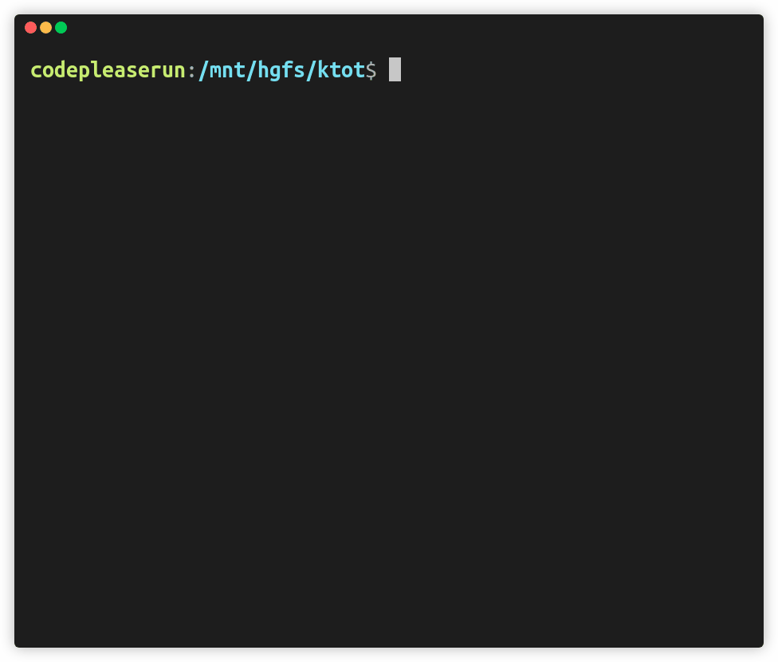

<div align="center"><h1>Ktot</h1> </div>
<div align="center"><h3>A simple, hotkeys-based time tracker</h3> </div>

</img>

<br>

<h2>What's Ktot? </h2>
Ktot (Keep track of time) try to make time tracking much more convinient. Ktot is (for the most part) operated by using hotkey combinations

<br>
<br>
<h2>Features</h2>

 <ul>
  <li><h3><b>It's global:</b></h3>

Which simply means that Ktot will work even if it's not focused. You need not Alt-Tab to the specific window and then click (or even worse, type) to start/stop the tracking. Just simply press the assigned hotkey from any window to get going</li>

  <li><h3><b>Custom labels:</b></h3>
  
  You can define your own custom labels to track. You can add/remove as many labels as you want.</li>
  <li><h3><b>Update existing labels:</b></h3>
  
  Name of existing labels can also be updated without losing their respective track log.</li>
  <li><h3><b>Timestamps:</b></h3>
  
  By default, timestamps of the beginning and ending of each individual session of every label is recorded.  </li>
  <li><h3><b>Lable statistics:</b></h3>
  
  Ktot has built in option to show simple statistics of every label. It can show basic information like number of sessions, total session time, etc.
  <padding></padding>


  </li>
  <li><h3><b>Customizable hotkeys:</b></h3>
  
  The control hotkeys can be customized according to one's preference or to avoid conflict with existing hotkey combination.
  </li>
</ul>

<br>
<h2>Installation</h2>

```bash
git clone https://github.com/CodePleaseRun/ktot.git
cd ktot
python install.py
```

If the installation failed using `python install.py`, you can also manually install the packages using `pip install`

**Windows:**

- `rich>=10.7.0`
- `click>=8.0.1`
- `keyboard>=0.13.5`

**Linux:**

- `rich>=10.7.0`
- `click>=8.0.1`
- `pynput>=1.7.3`

<br>
<h2>Usage</h2>

Simply run the following command within the `ktot/` directory:

```python
python3 ktot.py
```

It will try to read existing session log from `json/labels.json` and load it.
If it's your first time running the program then `labels.json` wiil be created in `json/` & a prompt will ask to add a label.

The porgram is then controlled using hotkeys from deafult control scheme.


<br>

<br>
<h2>labels.json</h2>

All the sessions recorded are saved `labels.json` as a single dictionary. Each label is assigned a key whose value is a single list. Each element of list is another list of 3 elements (call it `l1`):

```
[beginning_timestamp, ending_timestamp, elapsed_time]
```

`beginning_timestamp` & `ending_timestamp` are saved as seconds since epoch. Each list (`l1`) represent a single session.

<br>
<h2>Options</h2>

There are 2 options (or flags) which can be toggled. For more info run:

```python
python ktot.py --help
```

<br>


- By deafult, both starting and ending timestamps are saved as `(begining_stamp, ending_stamp, elsapsed_time)`.

  `--timestamp=False` would save only `elapsed_time` and replaces both `beginning_timestamp` & `ending_timestamp` with `-1` as `[-1, -1, elapsed_time]`.

<br>
<h2>Custom Control Schemes</h2>

`keyboard` package is used for Windows and `pynput` is used for Linux.
Both packages have different syntax for parsing the same hotkey combination. Thus, `json/hotkeys.json` contains a single combination written in 2 slightly different format, one for each package.

- **Windows:**

  `keyboard` parses both alphanumberic and special keys in same way. All keys are written in lowercase and separated by `+`.

  - <kbd>Ctrl</kbd> + <kbd>Shift</kbd> + <kbd>Space</kbd> is written as `ctrl+shift+space`
  - <kbd>Ctrl</kbd> + <kbd>Alt</kbd> + <kbd>X</kbd> is written as `ctrl+alt+x`

- **Linux:**

  `pynput` requires special keys to be enclosed under angle brackets `<` & `>`. Each key is separated by `+`

  - <kbd>Ctrl</kbd> + <kbd>Shift</kbd> + <kbd>Space</kbd> is written as `<ctrl>+<shift>+<space>`
  - <kbd>Ctrl</kbd> + <kbd>Alt</kbd> + <kbd>X</kbd> is written as `<ctrl>+<alt>+x`

<br>
<h2>Possible Future Updates</h2>

- Remapping controls to different hotkeys within the program
- Moving from json storage to a proper db. For a json file with 15 labels with 40k sessions each, average read and write time was 0.6 and 3.0 secs respectively
